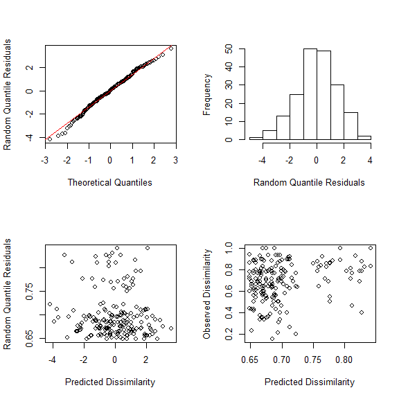

BBGDM
=====

[](https://travis-ci.org/skiptoniam/bbgdm)

BBGDM is a R package for running Generalized Dissimilarity Models with Bayesian Bootstrap for parameter estimation. To install package run the following command in your R terminal

``` r
install.packages(c('devtools'))
devtools::install_github('skiptoniam/bbgdm')
```

### Load the required libaries, we need vegan for the dune dataset.

``` r
library(bbgdm)
library(vegan)
```

### Run bbgdm on the famous dune meadow data

The dune meadow vegetation data, dune, has cover class values of 30 species on 20 sites. Make the abundance data presence/absence.

``` r
data(dune)
data(dune.env)
dune_pa <- ifelse(dune>0,1,0)
```

### Fit a bbgdm

Now we have a species by sites matrix of simulated data and a set data for a one dimensional gradient.

``` r
form <- ~1+A1
fm1 <- bbgdm(form,dune_pa, dune.env,family="binomial",link='logit',
             dism_metric="number_non_shared",spline_type = 'ispline',
             nboot=100, geo=FALSE,optim.meth='nlmnib')
```

    ## binomial regression is on the way. 
    ## Calculating number_non_shared dissimilarity
    ## Transforming covariates to  ispline  with  2 degrees of freedom.
    ## Bayesian bootstrap  10  iterations
    ## Bayesian bootstrap  20  iterations
    ## Bayesian bootstrap  30  iterations
    ## Bayesian bootstrap  40  iterations
    ## Bayesian bootstrap  50  iterations
    ## Bayesian bootstrap  60  iterations
    ## Bayesian bootstrap  70  iterations
    ## Bayesian bootstrap  80  iterations
    ## Bayesian bootstrap  90  iterations
    ## Bayesian bootstrap  100  iterations

### Plot response curves

``` r
plotResponse(fm1,plotdim = c(1,1))
```

 \#\#\# Plot diagnostics

``` r
bbgdm.check(fm1)
```

 \#\#\# Run 'Wald-like' test on parameters

``` r
library(xtable)
```

    ## Warning: package 'xtable' was built under R version 3.2.5

``` r
wt <- bbgdm.wald.test(fm1)
tab <- xtable(wt)
print(tab, type = "html")
```

<!-- html table generated in R 3.2.2 by xtable 1.8-2 package -->
<!-- Tue Jun 14 12:16:45 2016 -->
<table border="1">
<tr>
<th>
</th>
<th>
bbgdm\_W
</th>
<th>
bbgdm\_df
</th>
<th>
bbgdm\_p-value
</th>
</tr>
<tr>
<td align="right">
intercept
</td>
<td align="right">
12.45
</td>
<td align="right">
1.00
</td>
<td align="right">
0.00
</td>
</tr>
<tr>
<td align="right">
A1
</td>
<td align="right">
2.14
</td>
<td align="right">
3.00
</td>
<td align="right">
0.54
</td>
</tr>
</table>
